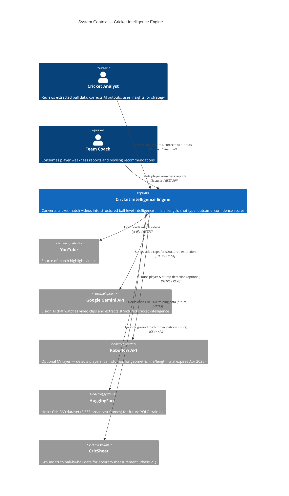
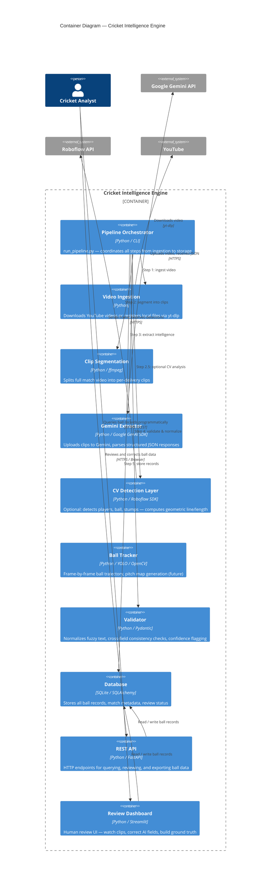
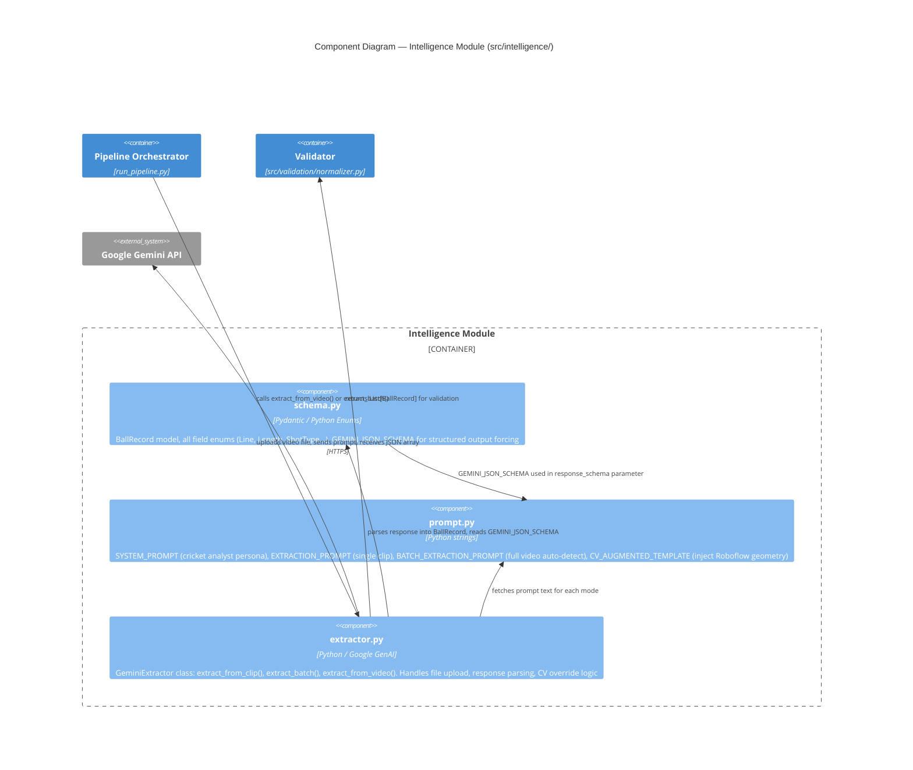
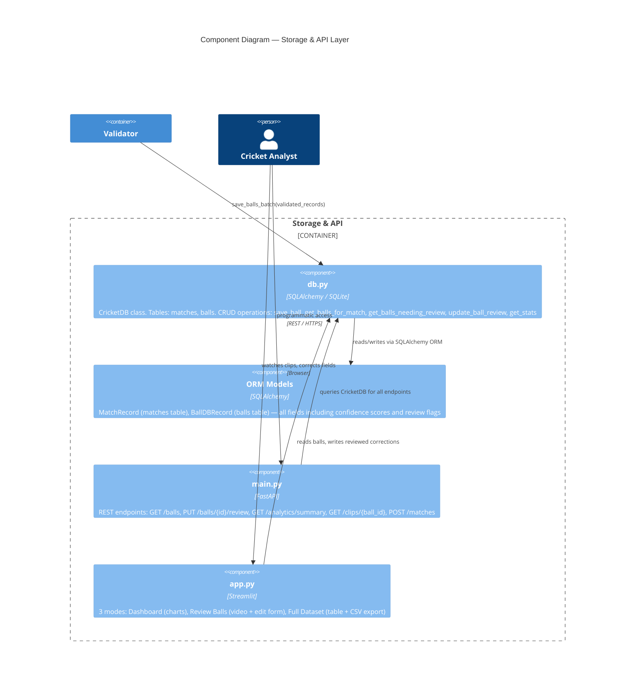
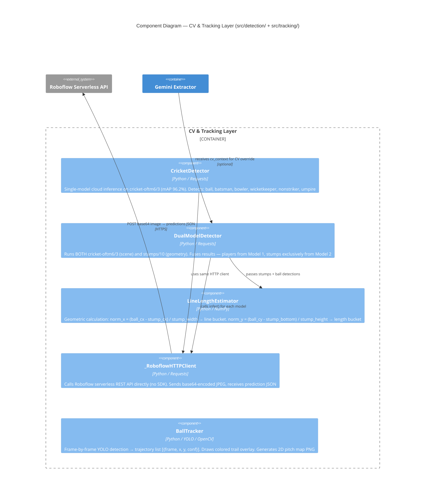
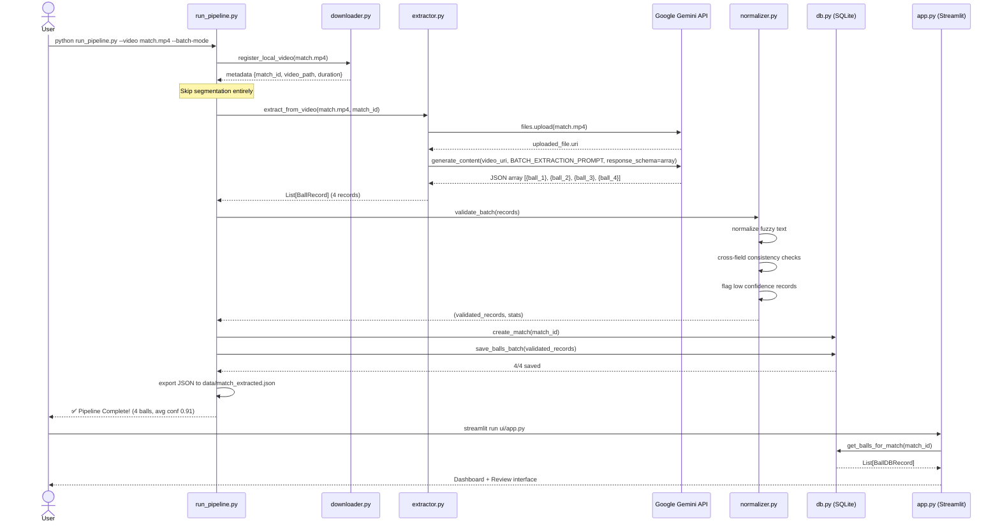
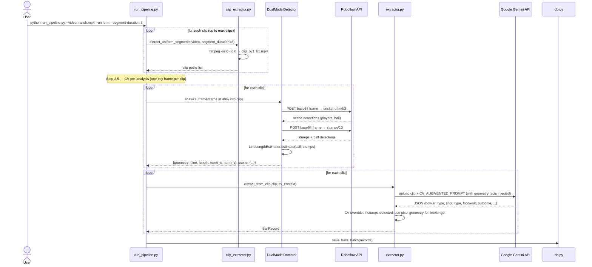
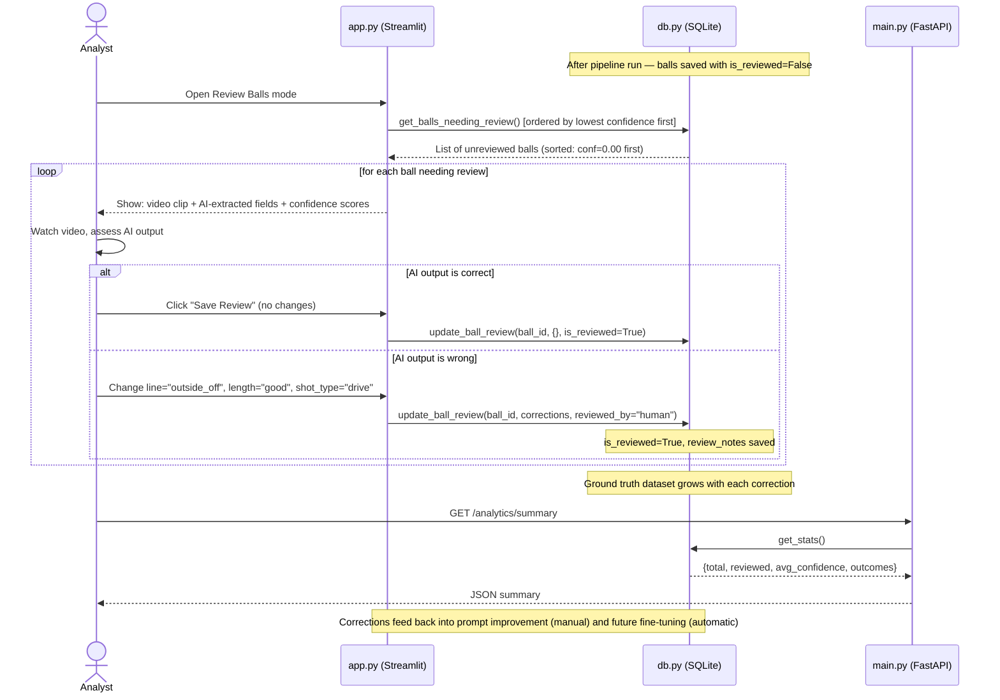
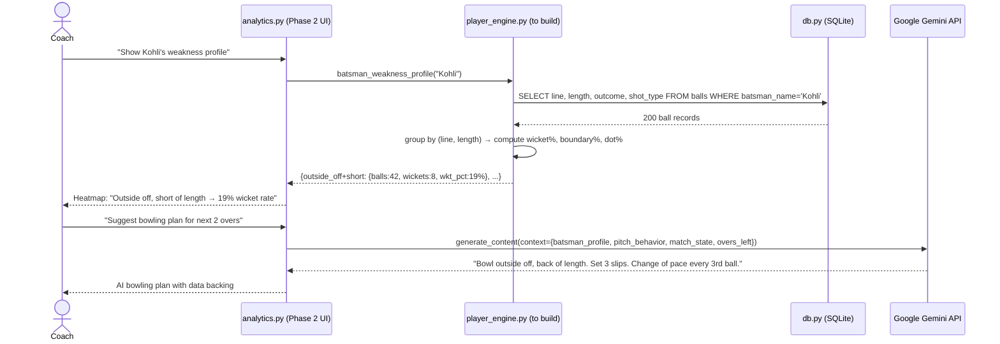
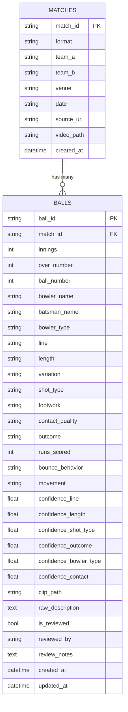

# 🏏 Cricket Intelligence Engine — C4 & Sequence Diagrams

All diagrams use [Mermaid](https://mermaid.js.org/) syntax — rendered natively in GitHub, VS Code, and Notion.

---

## C1 — System Context Diagram

> Who uses the system and what external services does it depend on?

---

## C2 — Container Diagram

> What are the deployable units inside the system?

---

## C3 — Component Diagram: Intelligence Module

> Components inside the most important container — the Gemini Intelligence layer

---

## C3 — Component Diagram: Storage & API

> Components inside the data storage and API layer

---

## C3 — Component Diagram: CV & Tracking Layer (Future)

> The optional computer vision layer — active when Roboflow API key is valid

---

## Sequence Diagram 1 — Batch Mode Pipeline (Primary)

> Full flow when user runs `python run_pipeline.py --batch-mode`

---

## Sequence Diagram 2 — Segmented Mode with Roboflow CV

> Flow when using `--uniform` mode with Roboflow pre-analysis active

---

## Sequence Diagram 3 — Human Review & Correction Loop

> How analyst corrections build ground truth over time

---

## Sequence Diagram 4 — Phase 2 Player Weakness Engine (Future)

> How Phase 2 analytics will work once 500+ reviewed balls exist

---

## Entity Relationship Diagram — Database Schema

